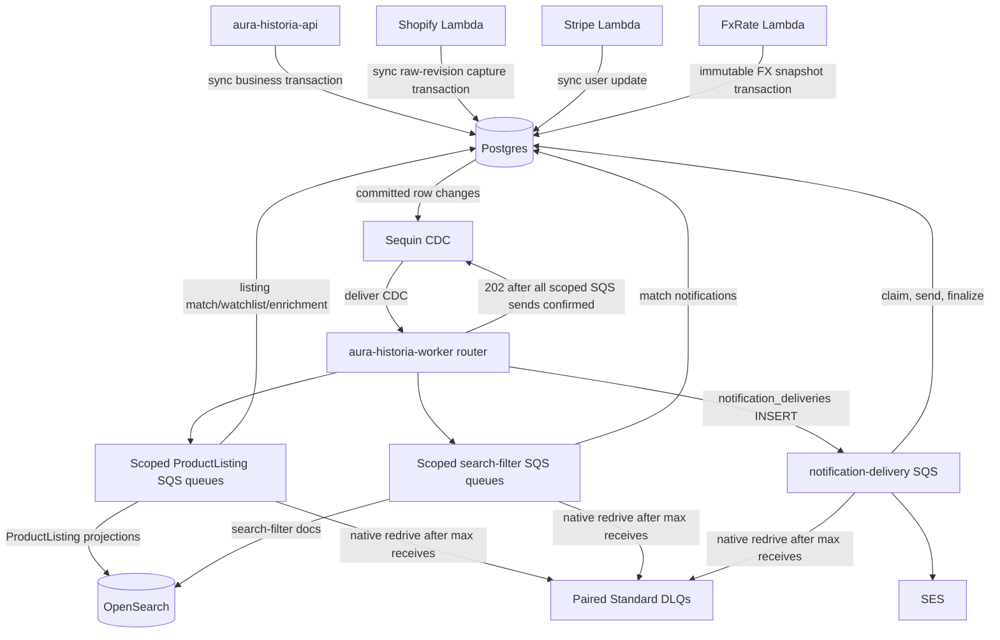
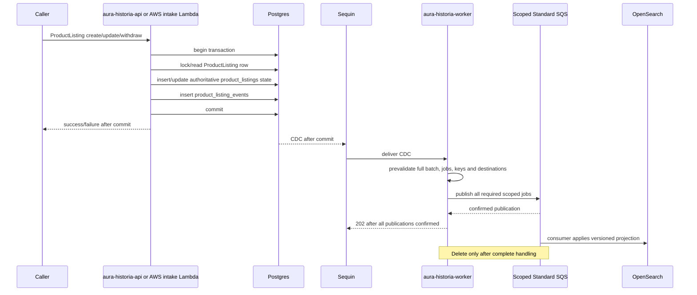

# Event Flow

Current PostgreSQL/Sequin flow with durable Standard SQS custody (#1558). See [architecture §12](../arch.md#12-cdc-and-projection-architecture) and the [durable-worker runbook](../durable-worker-runbook.md) for effective limits, deployment handoffs, and recovery.

## Components

| Component | Type | Purpose |
|---|---|---|
| Postgres | Database | Business source of truth and transactional ProductListing/event writes. |
| `product_listing_events` | Postgres table | ProductListing domain/enrichment event journal and CDC source. |
| `product_listing_raw_revisions` | Postgres table | Immutable raw ProductListing source evidence; CDC wake-up source for authoritative normalization only. |
| `notification_deliveries` | Postgres table | Durable email-delivery intent and lease state. |
| Sequin | CDC | Delivers committed Postgres changes to worker ingestion. |
| `aura-historia-worker` router | Rust process | Maps CDC rows to domain jobs and fans them out to queues. |
| Scoped Standard SQS source/DLQ pairs | Durable transport | One pair per native worker scope; source7d/DLQ14d retention, duplicate/reordered delivery possible. |
| OpenSearch | Search projection | Rebuildable ProductListing and search-filter projection. |
| FxRate Lambda | AWS Lambda | Captures immutable canonical EUR-base FX snapshots in Postgres. |
| `aura-historia-cron` | Rust process | UTC scheduled triggers for service-owned use cases. |
| Shopify Lambda | AWS Lambda | Captures changed Shopify raw ProductListing revisions; canonical normalization is asynchronous. |
| Stripe Lambda | AWS Lambda | Handles Stripe subscription events, writes Postgres directly. |
| CloudWatch log-retention Lambda | AWS Lambda | Keeps AWS log retention policy. |

## Routing diagram

## ProductListing write flow

Partner ProductListing API writes are synchronous and bypass raw capture. Crawler, Shopify, and WooCommerce are raw-only producers: each maps provider/source fields into generic `raw_values`, preserves its semantic source object, and captures an immutable changed raw revision. The crawler captures a selected extraction or verified removal; Shopify maps status/inventory before capture; WooCommerce verifies untouched signed bytes before parsing and maps topic/status/stock before capture. Signatures, headers, wire bytes, and raw JSON never enter logs or queues. Raw revisions independently retain optional `source_event_id` and provenance after receipt expiry. Provider receipt rows are created or reused only for observations that map to raw capture; they store only a canonical source-evidence digest, never source evidence or JSON, and logically expire after 90 days; `pg_ttl_index` reclaims physical rows asynchronously. An authorized ignored WooCommerce create/update status event returns before receipt construction and persists no receipt or receipt-based idempotency state, even when it supplies a delivery ID. No delivery identity or source timestamp is required for accepted intake. `Changed`, `Unchanged`, ignored, deduplicated, and stale outcomes acknowledge intake; WooCommerce `204` covers all of them, not canonical completion. The `product-listing-normalization` worker is the sole raw-to-canonical authority and also repairs missed wake-ups through authoritative reconciliation; accepted CDC wake-ups are durably held in SQS. PostgreSQL `product_listings` remains authoritative; `product_listing_events` is its transactional domain journal and direct Sequin CDC source, not an outbox. One logical domain write produces zero or one event: initial state is `PRODUCT_LISTING_DISCOVERED`; later semantic mutations are one non-empty `PRODUCT_LISTING_CHANGED` object. Discovery carries immutable `listing_source_id` and `source_listing_id`, initial facts, and image count only. Changed carries separate main-price, estimate, availability, URL, image-count, auction, lifecycle, and sale-observation dimensions. Sale observation is encoded as `None -> Some` for observation and `Some -> None` for retraction; correction from one observation to another is rejected. Payloads never contain image URLs or a redundant `kind`. Generic create, update, and upsert never capture FX or infer a sale observation from `SoldOut`.

No intermediate ProductListing command SQS queue. No `202 accepted because queued` behavior for migrated writes.

## Sequin fanout contract

`aura-historia-worker` exposes `POST /cdc/sequin` for CDC delivery.

Each native process subscribes to its own source table/operations and publishes only its scope's queue. Runtime composition supports ten production scopes; there is no user-tier scope or tier dimension, worker inbox, or processed-job table. Actual process/Sequin deployment remains externally owned.

1. Bound the request (1 MiB, 100 changes, 500 derived jobs). Prevalidate the **entire** batch, all typed jobs/keys, registered destinations and serialization before publishing anything.
2. For ProductListing events, require typed event/listing IDs and supported v1 pairs: `DOMAIN`/`PRODUCT_LISTING_DISCOVERED`, `DOMAIN`/`PRODUCT_LISTING_CHANGED`, `ENRICHMENT`/`ENRICHMENT_EMBEDDED`, or `ENRICHMENT`/`ENRICHMENT_TRANSLATED_TITLES`. Validate required discovery fields and exact changed dimensions, canonical values, complete previous/current endpoints, non-empty changes and image replacement semantics. Derive the routing union once.
3. Publish compact schema-1 jobs with domain-first `idempotency_key`/`ordering_key`. Unknown additive SQS envelope/payload fields are tolerated; required fields, schema/type/scope/IDs and keys remain strict. This does not loosen upstream event validation.
4. Return `202` only after **all** scoped SQS publications are confirmed within 8s (10s HTTP request deadline). Any validation, timeout or publication failure remains unacknowledged. A valid scope-irrelevant event can produce zero jobs and acknowledge.

Malformed later changes publish nothing; network failure can still partially publish. Crash/lost response before Sequin acknowledgment causes redelivery and possible duplicates. After acknowledgment, SQS retains jobs across worker death until complete handling/deletion, DLQ transfer or expiry. Source retention is 7 days, DLQ 14 days; Standard transfer preserves original enqueue age, not a fresh 14-day DLQ window. This is retention-bounded durable at-least-once, never exactly-once or ordered processing.

Only normalization's reconstructible cursor/continuation FIFO remains local. Startup/periodic authoritative traversal repairs missed wake-ups independently of durable SQS; see the [normalization runbook](../product-listing-raw-normalization-runbook.md).

## CDC routing

| Source table | Operation | Route |
|---|---|---|
| `product_listing_events` | INSERT | `DOMAIN`/`PRODUCT_LISTING_DISCOVERED` v1 routes to projector, percolator, content assessment, embedding, and translation. `DOMAIN`/`PRODUCT_LISTING_CHANGED` v1 routes to projector and percolator; main-price or availability dimensions also route watchlist, and an `images` dimension also routes embedding. `ENRICHMENT`/`ENRICHMENT_EMBEDDED` v1 and `ENRICHMENT`/`ENRICHMENT_TRANSLATED_TITLES` v1 route to projector and percolator. Image, price, and availability dimensions fan out independently, so a combined payload routes to the union. Embedded does not route translation. Lifecycle is a changed-event dimension, not an event group. |
| `product_listing_raw_revisions` | INSERT | `product-listing-normalization` only. Compact raw stream/revision IDs and revision number; never source JSON. The service drains the stream head in order and atomically writes terminal raw progress with zero or one canonical state/event. Candidate-data failures are terminal `REJECTED`; configuration/persistence failures leave progress pending. Capped direct drains and failures retain the SQS receipt. Bounded authoritative reconciliation has a reconstructible local FIFO/cursor. No direct projection, notification, enrichment, assessment or matching route. |
| `product_listings` | INSERT/MODIFY/DELETE | No deployed native subscription. ProductListing events are the projection trigger to avoid double-firing. |
| `search_filters` | INSERT/MODIFY/DELETE | Search-filter OpenSearch sync for every persisted change; handlers reread the complete authoritative record. Idempotency: `(user_search_filter_id, version, op)`. |
| `search_filter_matches` | INSERT | Search-filter match notification worker. It rereads the exact persisted match and ProductListing source, then inserts one PostgreSQL SearchFilter notification for that matching filter. Idempotency: `(user_id, user_search_filter_id, product_listing_id, origin_event_id)`. |
| `notification_deliveries` | INSERT | Notification-delivery worker. It validates initial `EMAIL`/`PENDING` shape, claims the durable delivery lease with joined source in PostgreSQL, sends through S3 templates and SES, then finalizes that lease. Idempotency and ordering: `notification-delivery:{delivery_id}`. Active claims defer, never complete; a send/finalize crash can still duplicate email. |
| `users` | MODIFY | No deployed native worker scope/subscription; do not route to these SQS queues. |
| `product_listing_watchlist` | INSERT/MODIFY/DELETE | No default downstream route; ProductListing events drive notifications. |
| `partnership_applications` | INSERT/MODIFY | No generic worker route. Decision writes create canonical notification delivery intents in the same PostgreSQL transaction. |

## Domain jobs

Worker sub-jobs use domain payloads or compact IDs and should not depend on raw Sequin JSON outside the router.

Current SQS payloads are `ProductListingEventJob`, `ProductListingRawRevisionJob`, `SearchFilterChangedJob`, `SearchFilterMatchCreatedJob`, and `NotificationDeliveryCreatedJob`. They contain compact typed identifiers/revisions, not source evidence. Handlers read authoritative source through service ports. SQS message IDs, receipts and redrive timestamps are not business identity.

## Consumers and scheduled matching

| Sub-worker | Replaces | Input | Side effects |
|---|---|---|---|
| ProductListing OpenSearch projector | `aura-historia-worker` | ProductListing event job | Writes a full active document or content-free, external-versioned withdrawal tombstone. |
| Watchlist notification generator | retired notification Lambda path | Price/availability ProductListing event job | Locks current ProductListing lifecycle through PostgreSQL notification and delivery-intent commit; inserts one row per semantic reason. |
| Notification delivery dispatcher | PostgreSQL delivery flow | `notification_deliveries` insert job | Claims PostgreSQL delivery lease, dispatches by persisted channel, and finalizes durable delivery state. EMAIL resolves its current target, renders S3 templates, and sends through SES. |
| Search-filter percolator | `aura-historia-worker` | Domain/enrichment ProductListing event job | Postgres matches only. |
| Search-filter match notification generator | Search-filter match notification path | Search-filter match inserted job | One PostgreSQL SearchFilter notification per matching filter. |
| ProductListing content assessment | `PRODUCT_LISTING_DISCOVERED` events | ProductListing event job | Reads current listing text and writes a content-source-revision guarded assessment row. It emits no ProductListing event and never writes OpenSearch. |
| ProductListing embed | legacy `product-pipeline-embed-text` | `PRODUCT_LISTING_DISCOVERED` or changed job with `images` | Postgres enrichment event + ProductListing update. Embedding stored in Postgres only. |
| ProductListing translate | legacy `product-pipeline-translate` | `PRODUCT_LISTING_DISCOVERED` job | Postgres `product_listing_translations` upsert plus one translated-titles enrichment event and ProductListing revision update; first committed completion wins for each content source event. |
| Search-filter OpenSearch sync | `aura-historia-worker` | Search-filter changed job | OpenSearch percolator document write/tombstone from complete Postgres state, with external source-version protection. Search-filter embedding stays in Postgres. |
| ProductListing normalization | raw-to-canonical service | Raw revision job plus authoritative reconciliation | Atomic canonical state/event and raw progress; local continuation hints are reconstructible. |
| Periodic matcher | retired ECS periodic matcher | `aura-historia-cron` native UTC cron daemon | Runs `RunPeriodicSearchFilterMatching`; it writes only idempotent `search_filter_matches`. CDC remains the sole notification trigger. |

All ten SQS consumers above are composed in `aura-historia-worker`. Periodic matching stays in `aura-historia-cron`, not another queue scope.

## Canonical ProductListing OpenSearch projection

PostgreSQL `product_listings`, `product_listing_translations`, and immutable `fx_rates` are authoritative. The `product-listings` OpenSearch index is rebuildable only. Each committed `product_listing_events` insert creates one ProductListing projection job with stable `(event_id, product_listing_id)` IDs. The handler rereads complete current ProductListing state and rejects a trigger whose event ID is no longer current. It loads the exact observation FX snapshot only for an active `SoldOut` listing with both an observation and a main source price, commits its PostgreSQL read transaction, then writes the complete private document with `product_listings.projection_version` as OpenSearch external version.

Current `Withdrawn` state replaces the full document with content-free `{productListingId, projectionDeleted: true}` at that external version. Raw OpenSearch GET returns 200 with this marker, not 404. All product search, hybrid BM25/KNN and similar-listing readers exclude true before pagination/ranking; absent markers remain live. Current `Active` state, including restore, writes a full document only at a newer source version. Live documents have optional `availability` but no lifecycle field. Duplicate/older writes and stale withdrawals after restore are stale no-ops. Missing required observation FX fails for retry.

This fence survives physical-delete `index.gc_deletes`; never TTL or physically delete tombstones. Deploy mappings and all readers before writers, fence old physical-DELETE writers including in-flight requests, and use the [fenced rebuild procedure](../durable-worker-runbook.md#projection-fences-and-rebuild), not index reset. Withdrawn source rows support backfill; absent historical deletion facts do not.

The document stores native `sourcePrice`, immutable HalfUp `salePrices` only when a qualifying observation has a main source price, and `saleObservationFxRateId` / `saleObservedAt` independently. A sold no-main-price document has observation metadata but no `sourcePrice` or `salePrices`; it remains searchable by non-price criteria and maps to `SaleObservation` valuation with no display price. All existing search fields and the authoritative embedding remain. It never stores estimates. ProductListing search cursor chains and similar-listing KNN reads pin one persisted snapshot for active summary conversion; sold summaries use indexed immutable sale amounts when present and preserve the valuation basis. Run the `product-listing-opensearch` scope with `POSTGRES_*`, `OPENSEARCH_ENDPOINT_URL`, and OpenSearch credentials outside local development. Its Sequin subscription must contain only `product_listing_events` inserts.

## Canonical ProductListing embedding

The product-embedding scope accepts only `product_listing_events` inserts and enqueues `PRODUCT_LISTING_DISCOVERED` plus `PRODUCT_LISTING_CHANGED` events whose validated payload has the `images` dimension. Its service use case accepts only those semantic sources and requires `product_listings.embedding_source_event_id` to equal the trigger event ID. It supplies the title, optional description, and first image URL to neutral `embedding` before opening a short PostgreSQL transaction. The configured embedding adapter owns provider-specific prompt format. An image change advances that marker and clears the stored vector atomically. The writer locks and rechecks the marker, stores the normalized 768-float vector, appends compact `ENRICHMENT_EMBEDDED` provenance containing only `sourceEventId`, and advances `product_listings.current_event_id` plus projection version. Exact redelivery is target-side duplicate detection by source event, so the first committed vector wins; only a superseding embedding source is stale.

Worker deployment uses `AURA_HISTORIA_WORKER_SCOPE=product-embedding`; it requires `POSTGRES_*`, `VERTEX_AI_PROJECT_ID`, `VERTEX_AI_LOCATION`, and Google ADC. It does not require `VERTEX_AI_MODEL`: the neutral embedding adapter owns its provider model. Its Sequin subscription must contain only `product_listing_events` inserts. Provider calls happen before the write transaction; failures create no partial Product state.

## Canonical ProductListing translation

The product-translation scope accepts only `product_listing_events` inserts and enqueues only `PRODUCT_LISTING_DISCOVERED`; `ENRICHMENT_EMBEDDED` has no translation route. Its service use case rereads the committed source and requires `product_listings.content_source_event_id` to equal the trigger event ID before invoking the configured neutral `large-language-model` translator. It translates a non-empty native title into the supported target languages other than the source language, then opens a short PostgreSQL transaction. The writer locks the ProductListing, detects an existing valid translated-titles completion by source event before stale comparison, rechecks the content-source marker for new work, upserts provenance-bearing `product_listing_translations`, appends one compact translated-titles enrichment event with source language and target-language codes only, and advances `product_listings.current_event_id` plus projection version. Redelivery is target-side idempotent: the first committed completion wins regardless of later LLM text; only a never-completed superseded content source is stale.

Worker deployment uses `AURA_HISTORIA_WORKER_SCOPE=product-translation`; it requires `POSTGRES_*`, `VERTEX_AI_PROJECT_ID`, `VERTEX_AI_LOCATION`, `VERTEX_AI_MODEL`, and Google ADC. Its Sequin subscription must contain only `product_listing_events` inserts. LLM calls happen before the short PostgreSQL write transaction; provider failures are retried by the worker and do not create partial translation state.

## Canonical search-filter percolator

The percolator scope accepts only `product_listing_events` inserts. It enqueues only `DOMAIN` and `ENRICHMENT` ProductListing events, parsing typed event and ProductListing IDs once at CDC ingress, rereads the committed typed ProductListing match source including immutable `product_listing_events.event_time`, and invokes `MatchProductListingEventUseCase`. The use case compares the source event ID with `product_listings.current_event_id` before percolating; a superseded trigger is skipped, never evaluated against newer ProductListing state with its old origin ID. A current withdrawn listing is an explicit inactive-source skip: it performs no percolation, evaluation, or match write. For an accepted active current event with a main source price, it uses the immutable sale snapshot when present; otherwise it reads latest persisted FX with `captured_at <= origin_event_time`, ordered by capture then generation. It converts the price into every supported currency only in the private temporary percolation document. Stored filter queries remain FX-independent. Current active events percolate the canonical OpenSearch filter projection, then batch enhanced candidates through the neutral typed `large-language-model` capability. The service owns the product-match prompt, structured response schema, typed response mapping, retry policy, and first-five-product-image policy; the capability owns Vertex protocol, credentials, image fetch, generic output deserialization, and its configured provider model. The worker selects that model through required `VERTEX_AI_MODEL` configuration, not use-case code. The final short PostgreSQL transaction locks/rechecks the ProductListing current event, then batch-locks active filters through match commit. Candidates must still have the exact evaluated semantic search plus embedding; changed inputs/deactivation/deletion suppress them, but unrelated name/notification edits remain eligible. It stores eligible idempotent plain or successful-enhanced matches. An enhanced candidate failure never prevents those writes: retryable timeout, transport, 429, 5xx, and malformed-response failures return after commit for normal worker retry; permanent provider 4xx failures are explicit in the use-case result and never create a match. Vertex requests use a 10-second connect and 30-second total timeout, bounded concurrency, at most five product-image fetches per evaluation request, structured JSON, and reasons in the filter search language.

Worker deployment uses `AURA_HISTORIA_WORKER_SCOPE=search-filter-percolator`; its Sequin subscription must contain only `product_listing_events` inserts. Unsupported ProductListing event group/type/version pairs and malformed routing payloads reject before fanout; supported events irrelevant to this scope produce zero jobs and acknowledge normally. ProductListing-event redelivery is safe through the match uniqueness key; price matches retain `EVENT` or `SALE_OBSERVATION` snapshot provenance, while non-price matches retain null valuation provenance. Processed, duplicate, stale, inactive-source, missing-source, and ignored-event outcomes are recorded separately. FX capture has no percolation, ProductListing projection, match, or notification route.

## Search-filter match notification generator

The match-notification scope accepts only `search_filter_matches` inserts. Its job and source read use `(user_id, user_search_filter_id, product_listing_id, origin_event_id)`, so a stale or superseded CDC row cannot notify a different match. It reads the committed Product source and invokes `GenerateSearchFilterMatchNotificationUseCase` for every persisted matching filter. The transaction-scoped ProductListing source uses a `FOR SHARE` row lock through notification and delivery-intent commit; it does not compare the historical origin event with `current_event_id`. Missing or mismatched match sources are benign stale inputs. The use case locks the user tier and calculates the event's stable monthly notification rank; this gates delivery eligibility only, never match persistence. PostgreSQL inserts the notification and optional external-delivery rows atomically. Exact CDC redelivery and concurrent filters are protected by the SearchFilter semantic identity, so each matching filter remains distinct.

Worker deployment uses `AURA_HISTORIA_WORKER_SCOPE=search-filter-match-notification`; its Sequin subscription must contain only `search_filter_matches` inserts. Match updates and deletes have no notification route.

Enhanced search filters use the canonical Vertex AI Gemini implementation of the neutral typed `large-language-model` capability. Timeout, transport, 429, 5xx, and malformed-response failures are retryable worker failures after plain/successful matches commit. Other provider 4xx failures are permanent candidate failures. The worker never treats an enhanced filter as matched or silently bypasses evaluation.

## Canonical watchlist notification generator

The watchlist worker scope accepts only `product_listing_events` inserts and enqueues canonical price/availability events. The ProductListing service reads the immutable source and uses persisted `product_listing_events.event_time` as the eligibility timestamp. `product_listing_watchlist.active_since` is the beginning of the current active interval; `notifications_enabled_since` is the beginning of the current email-enabled interval.

At processing time, a recipient must still have `state = ACTIVE` and `active_since <= product_listing_events.event_time`. Email delivery additionally requires `notifications = true` and `notifications_enabled_since <= product_listing_events.event_time`. Thus late activation and late email enablement do not receive older events; a late email enablement can still receive the in-app notification. Deactivation and reactivation start a new active interval, and disabling and re-enabling email starts a new email interval. The current state is authoritative, so an entry inactive when processed receives neither channel.

Before writing, the use case reads the exact ProductListing event and uses its immutable event time for recipient eligibility. A later unrelated `current_event_id` does not suppress this historical fact. The source query locks the current ProductListing row with `FOR SHARE`; that lock remains held while recipients, notifications, and delivery intents are written through commit. The current listing must still be `ACTIVE`; a withdrawn listing is explicitly suppressed to avoid creating a snapshot for a hidden listing. Missing sources and changed events without main-price or availability changes are acknowledged successful outcomes, not retryable failures. Worker logs distinguish applied work, duplicates, ignored events, missing sources, and withdrawn suppression.

Watchlist semantic identity is `(user_id, origin_event_id, kind)`, so a price change and availability change remain distinct. Recipients with email disabled or email enabled after the event receive the in-app notification without a `notification_deliveries` row.

Duplicate webhook delivery is safe through the PostgreSQL semantic unique index. No currency conversion is invented: price-change payloads carry only each stored source price; rendering localizes from current user preferences.

Worker deployment uses `AURA_HISTORIA_WORKER_SCOPE=watchlist-notification`; its Sequin subscription must contain only `product_listing_events` inserts. The default `search-filter-projection` scope remains separately subscribed to `search_filters`.

## Canonical notification delivery

The `notification-delivery` scope accepts only `notification_deliveries` inserts and publishes schema-1 SQS jobs carrying `notification_delivery_id`; idempotency/ordering is `notification-delivery:{delivery_id}`. Deliveries are unique per `(notification_id, channel, target_key)`. The service atomically claims a five-minute PostgreSQL lease and loads source, commits before channel I/O, then dispatches once within a four-minute total budget. EMAIL alone resolves current `PRIMARY`, renders S3 templates and calls SES with SDK max attempts 1.

Active claims defer until persisted expiry +5s; reclaimable `PENDING`/expired-claim races defer 1s. Neither acknowledges. Current runtime retries missing delivery rows too. Known transient rejection/pre-send failures finalize back to `PENDING`; permanent/source failures require confirmed `FAILED` finalization. Ambiguous SES timeout/transport/unknown/5xx/missing-receipt outcomes keep the lease, give no acknowledgment and never resend inside the attempt.

Retry only finalization with the original lease token, completion time and provider receipt/error tuple. Root migration `migrations/20260907000000_notification_completion_receipt.sql` adds `completed_lease_token`/`completed_at` so an exact persisted completion can confirm a lost response without another write/send. Only confirmed terminal outcomes permit SQS deletion; lease loss/unconfirmed finalization remains retryable. A crash after SES acceptance can still cause duplicate email after reclaim. See [notification recovery](../durable-worker-runbook.md#notification-recovery-limits).

Worker deployment uses `AURA_HISTORIA_WORKER_SCOPE=notification-delivery`; it requires `POSTGRES_*`, `S3_BUCKET_NAME_TEMPLATES`, `NOTIFICATION_EMAIL_FROM`, `NOTIFICATION_EMAIL_REPLY_TO`, `STAGE`, `COMMIT_SHA`, and AWS credentials with template-read plus SES-send permissions. Configure one Sequin subscription for `notification_deliveries` `INSERT` only, plus the matching source queue URL and `AWS_REGION`; the process needs scoped SQS publisher/consumer permissions in addition to S3/SES.

## Canonical search-filter OpenSearch projection

`search_filters` in Postgres is authoritative. `user_search_filters` is the single rebuildable canonical OpenSearch projection.

- This worker's Sequin subscription is scoped to `search_filters`; any other table is rejected before acknowledgment rather than being accepted into an unconsumed queue.
- The worker routes every committed `search_filters` insert, update, and delete to `SearchFilterOpenSearch` with `(user_search_filter_id, version, operation)`.
- The projection worker treats insert/update CDC rows as invalidations: it rereads complete committed Postgres state, maps all ProductSearch fields, and compiles the requested price range directly against private temporary `priceByCurrency.<currency>` fields. It writes with OpenSearch external versioning from `search_filters.version`; FX capture alone never writes saved filters.
- `search_filters` uses `REPLICA IDENTITY FULL` so delete CDC carries the old owner and version. Deletes replace the full document/query with content-free `{userSearchFilterId, sourceVersion, projectionDeleted: true}` at deterministic successor external version (`search_filters.version + 1`). Query and PIT percolation exclude true; missing marker remains live. Raw GET returns 200, not 404. Older/equal target versions conflict as stale no-ops.
- A malformed CDC row without the identifier, owner, or version is rejected so Sequin retries; it is never silently skipped.

Tombstones retain the fence beyond physical-delete GC; never expire or physically delete them. Deploy mappings/all readers before writers and fence old physical-DELETE requests. Hard-deleted filters leave no current row with their deletion version: online backfill needs retained delete facts, otherwise use an externally fenced fresh-generation rebuild. See the [runbook](../durable-worker-runbook.md#projection-fences-and-rebuild); simply recreating the index is unsafe.

## AWS survivor event flow

These AWS event flows stay:

| Source | Route | Target |
|---|---|---|
| Compute-stack creation or EventBridge schedule | bootstrap or cron | `fxrate-lambda`; captures one idempotent canonical FX snapshot in Postgres per source event ID |
| Shopify partner EventBridge/SQS | Shopify product events | `shopify-lambda`; this is external intake buffering before sync Postgres product/event writes, not the removed product command queue. |
| Stripe partner EventBridge | subscription events | `stripe-lambda`; Lambda invokes canonical User service handlers with direct Postgres adapters for atomic user tier/customer updates. |
| CloudWatch log group events | EventBridge | CloudWatch log-retention Lambda |

The Shopify EventBridge-to-SQS target uses EventBridge's default delivery policy: up to 24 hours of event age and 185 retry attempts. It has no custom target retry policy or EventBridge DLQ override. The primary SQS queue uses the SQS/CDK default 4-day retention; its attached DLQ retains messages for 14 days. Manual redrive must begin while the message remains retained by the applicable SQS queue; it cannot recover an expired message.

## Idempotency

Prefer domain IDs or domain versions over Sequin IDs.

Minimum unique keys:

| Area | Key |
|---|---|
| Product event | `product_listing_events.event_id` |
| Product materialized state | `product_listings.current_event_id` |
| Product worker job | `product_listing_events.event_id` |
| Scheduled or deployment-bootstrap FX snapshot | `fx_rates.source_event_id` |
| Provider raw-capture receipt | `(raw stream, provider scope, delivery ID)` only for an observation that maps to raw capture; authorized ignored WooCommerce create/update status events persist no receipt. |
| Search-filter worker job | `(user_search_filter_id, version, op)` |

| Search-filter match job | `(user_id, user_search_filter_id, product_listing_id, origin_event_id)` |
| Search-filter match | `(user_search_filter_id, product_listing_id)` plus `origin_event_id` FK to `product_listing_events.event_id` |
| Search-filter notification | `(user_id, user_search_filter_id, product_listing_id, origin_event_id)` PostgreSQL unique index |
| Watchlist notification | `(user_id, origin_event_id, kind)` PostgreSQL unique index |
| Notification delivery job | `notification-delivery:{delivery_id}`; order `notification-delivery:{delivery_id}` |

Sequin ID/LSN can be logged for debugging, but do not make it the normal idempotency key when a domain key exists.

External sends remain at-least-once. Notification duplicate protection is at record creation, not SES delivery.

## Retry and failure handling

Standard SQS owns job custody; there is no worker-owned PostgreSQL inbox, processed-job or dead-letter table. Effective per-process concurrency is deliberately 1 with no prefetch, poll 20s, scope visibility 60/300/360s and execution budgets 45/240s. Heartbeats extend visibility; dependency circuits pause consumption while ingress can still publish. Retry visibility backs off 30–900s with jitter; native max receives 5 sends failures/poison to the paired DLQ. Only `Complete` permits deletion; shutdown alone never confirms work, though completed active work may settle during the bounded drain.

Malformed upstream CDC remains stuck/unacknowledged in Sequin, not the SQS DLQ. Invalid wire jobs and handler failures remain undeleted. Repair before controlled native redrive using separate approved operator authorization; never purge. Source-to-DLQ transfer preserves original enqueue age. See the [safe operations/runbook](../durable-worker-runbook.md) for sandbox gates, retention/archive limits and legacy in-memory cutover. Only the normalizer has the documented authoritative raw-backlog reconciliation path.

## Operations notes

Postgres remains business truth; monitor replication lag/WAL, Sequin retries, queue age/DLQ and target state. CDK defines prod source-age >=900s and DLQ-visible >=1 alarms; worker outcome/circuit/normalization events are logs, not provisioned custom metrics or dashboards. External owners must configure worker identity/deployment and Sequin timeout >10s (15s recommended), batch <=100; the repo contains Sequin test fixtures only. Cutover must pause Sequin and drain/capture old in-memory queues **and DLQs before stop**; no new transport recovers previously lost jobs.

## Test guidance

- Use Postgres integration tests for repositories.
- Use fake CDC envelopes for router fanout tests.
- Use `test-api` Sequin helpers for real Sequin webhook delivery tests when CDC behavior matters.
- Use LocalStack SQS plus real OpenSearch targets for projection/percolator tests. Cover crash after acknowledgment, duplicate/stale writes, poison/visibility failure, schema compatibility, tombstones beyond delete GC, and notification finalization ambiguity.
- Real AWS smoke is opt-in and sandbox-gated, never required credentials in CI. Documentation or test presence is not proof the suite ran.
- Keep CDK/CloudFormation helpers only for AWS services still used by the test stack.
