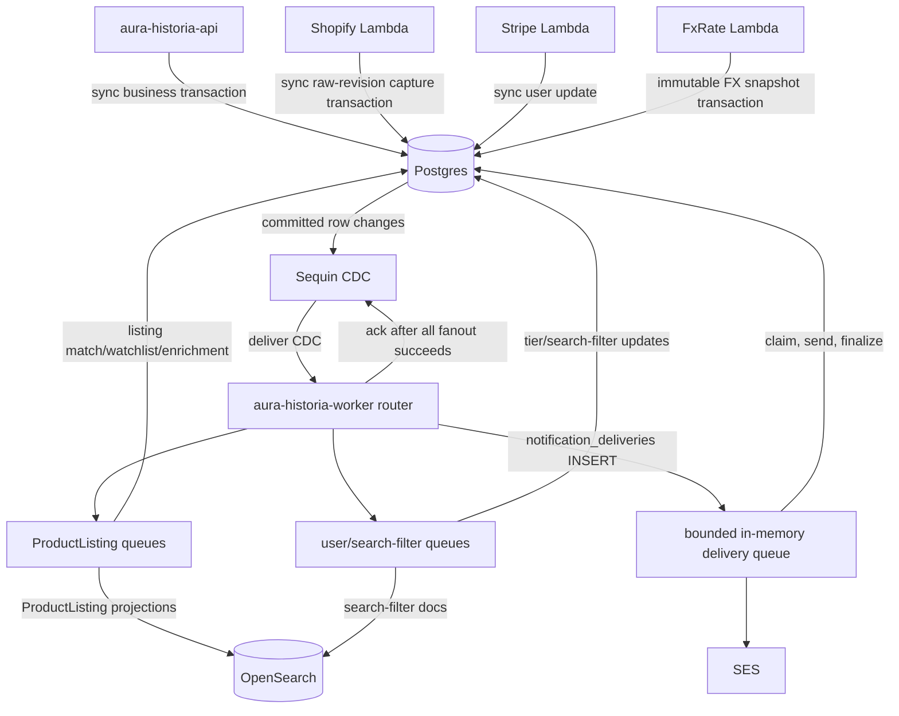
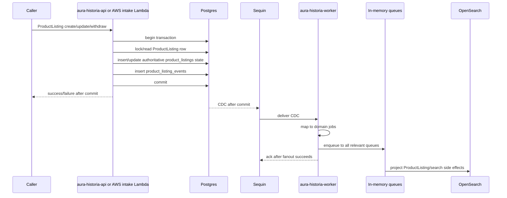

# Event Flow

This document describes the current Postgres/Sequin event flow for #1341.

See `docs/hetzner_postgres_sequin_migration.md` for the ADR.

## Target components

| Component | Type | Purpose |
|---|---|---|
| Postgres | Database | Business source of truth and transactional ProductListing/event writes. |
| `product_listing_events` | Postgres table | ProductListing domain/enrichment event journal and CDC source. |
| `product_listing_raw_revisions` | Postgres table | Immutable raw ProductListing source evidence; CDC wake-up source for authoritative normalization only. |
| `notification_deliveries` | Postgres table | Durable email-delivery intent and lease state. |
| Sequin | CDC | Delivers committed Postgres changes to worker ingestion. |
| `aura-historia-worker` router | Rust process | Maps CDC rows to domain jobs and fans them out to queues. |
| In-memory sub-worker queues | Worker buffers | Bounded execution buffers. Not durable. |
| OpenSearch | Search projection | Rebuildable ProductListing and search-filter projection. |

| FxRate Lambda | AWS Lambda | Captures immutable canonical EUR-base FX snapshots in Postgres. |
| `aura-historia-cron` | Rust process | UTC scheduled triggers for service-owned use cases. |
| Shopify Lambda | AWS Lambda | Captures changed Shopify raw ProductListing revisions; canonical normalization is asynchronous. |
| Stripe Lambda | AWS Lambda | Handles Stripe subscription events, writes Postgres directly. |

| CloudWatch log-retention Lambda | AWS Lambda | Keeps AWS log retention policy. |

## Target routing diagram

## ProductListing write flow

Partner ProductListing API writes are synchronous. Shopify captures only an immutable raw revision after provider-owned status, inventory, and field mapping; its `source_payload` preserves complete semantic Shopify product JSON while generic `raw_values` plus source configuration form the normalization input. WooCommerce verifies the untouched signed body before parsing, then captures only an immutable raw revision after provider-owned topic, status, stock, and field mapping; its `source_payload` preserves complete semantic product JSON while signatures, headers, and wire bytes are never stored. `Changed` and `Unchanged` capture outcomes acknowledge the intake request; WooCommerce `204` means durable raw acceptance, not canonical completion. The `product-listing-normalization` worker later performs the canonical ProductListing transaction. PostgreSQL `product_listings` remains authoritative; `product_listing_events` is its transactional domain journal and direct Sequin CDC source, not an outbox. One logical domain write produces zero or one event: initial state is `PRODUCT_LISTING_DISCOVERED`; later semantic mutations are one non-empty `PRODUCT_LISTING_CHANGED` object. Discovery carries immutable `listing_source_id` and `source_listing_id`, initial facts, and image count only. Changed carries separate main-price, estimate, availability, URL, image-count, auction, lifecycle, and sale-observation dimensions. Sale observation is encoded as `None -> Some` for observation and `Some -> None` for retraction; correction from one observation to another is rejected. Payloads never contain image URLs or a redundant `kind`. Generic create, update, and upsert never capture FX or infer a sale observation from `SoldOut`.

No intermediate ProductListing command SQS queue. No `202 accepted because queued` behavior for migrated writes.

## Sequin fanout contract

`aura-historia-worker` exposes `POST /cdc/sequin` for CDC delivery.

There is no durable `worker_inbox` table.

Minimum ingest steps:

1. Receive CDC envelope.
2. Validate source/table/operation.
3. For `product_listing_events`, parse typed `event_id` and `product_listing_id`; require the event type, group, positive schema version, and a valid v1 payload. Accept only v1 pairs: `DOMAIN`/`PRODUCT_LISTING_DISCOVERED`, `DOMAIN`/`PRODUCT_LISTING_CHANGED`, `ENRICHMENT`/`ENRICHMENT_EMBEDDED`, and `ENRICHMENT`/`ENRICHMENT_TRANSLATED_TITLES`.
4. Validate discovery required fields and changed dimensions, including exact fixed-object shapes, canonical primitive values, non-empty changes, complete previous/current endpoints, and equal-count image replacement. Reject malformed IDs, payloads, and unsupported type/group/version pairs before fanout, so Sequin retries.
5. Derive the routing union once, then enqueue only typed ProductListing IDs and event IDs.
6. Derive domain-first `idempotency_key` and `ordering_key`.
7. Map change to one or more domain jobs.
8. Enqueue every job to every relevant bounded in-memory queue.
9. Return `202` to Sequin only after all enqueue operations succeed.
10. Return non-2xx when validation or fanout fails so Sequin retries.

Crash rule:

- Crash before Sequin ack: Sequin redelivers.
- Crash after Sequin ack: queued in-memory jobs may be lost if the process dies before sub-workers finish.
- MVP accepts this risk for existing scopes; durable queue follow-up is #1558.
- `product-listing-normalization` is the exception: startup and periodic bounded pending-stream reconciliation repair its missed wake-ups.

## CDC routing

| Source table | Operation | Route |
|---|---|---|
| `product_listing_events` | INSERT | `DOMAIN`/`PRODUCT_LISTING_DISCOVERED` v1 routes to projector, percolator, content assessment, embedding, and translation. `DOMAIN`/`PRODUCT_LISTING_CHANGED` v1 routes to projector and percolator; main-price or availability dimensions also route watchlist, and an `images` dimension also routes embedding. `ENRICHMENT`/`ENRICHMENT_EMBEDDED` v1 and `ENRICHMENT`/`ENRICHMENT_TRANSLATED_TITLES` v1 route to projector and percolator. Image, price, and availability dimensions fan out independently, so a combined payload routes to the union. Embedded does not route translation. Lifecycle is a changed-event dimension, not an event group. |
| `product_listing_raw_revisions` | INSERT | `product-listing-normalization` only. The typed wake-up carries raw stream ID, raw revision ID, and revision number; it never carries source JSON. The service drains the stream head in order, writes canonical ProductListing state/events and raw progress atomically, and startup/periodic reconciliation repairs a missed post-ack wake-up. Raw revisions never route directly to projections, notifications, translation, embedding, content assessment, or matching. |
| `product_listings` | INSERT/MODIFY/DELETE | No default downstream route. ProductListing events are the projection trigger to avoid double-firing. Use listing CDC only for future explicit non-event projections. |

| `search_filters` | INSERT/MODIFY/DELETE | Search-filter OpenSearch sync for every persisted change; handlers reread the complete authoritative record. Idempotency: `(user_search_filter_id, version, op)`. |
| `search_filter_matches` | INSERT | Search-filter match notification worker. It rereads the exact persisted match and ProductListing source, then inserts one PostgreSQL SearchFilter notification for that matching filter. Idempotency: `(user_id, user_search_filter_id, product_listing_id, origin_event_id)`. |
| `notification_deliveries` | INSERT | Notification-delivery worker. It validates initial `EMAIL`/`PENDING` shape, claims the durable delivery lease with joined source in PostgreSQL, sends through S3 templates and SES, then finalizes that lease. Idempotency: `notification-delivery:{delivery_id}`; ordering: `notification:{notification_id}`; external delivery remains at-least-once across a send/finalize crash. |
| `users` | MODIFY | User tier enforcement for tier changes; no user OpenSearch projection. Idempotency: `(user_id, version)`. |
| `product_listing_watchlist` | INSERT/MODIFY/DELETE | No default downstream route; ProductListing events drive notifications. |
| `partnership_applications` | INSERT/MODIFY | No generic worker route. Decision writes create canonical notification delivery intents in the same PostgreSQL transaction.

## Domain jobs

Worker sub-jobs use domain payloads or compact IDs and should not depend on raw Sequin JSON outside the router.

Current router jobs carry only typed ProductListing event/aggregate IDs or raw-revision stream/revision IDs. Sub-worker implementation issues must introduce typed DTOs/payloads where behavior depends on event/change fields. Those DTOs should be derived from Postgres/domain rows, not from Sequin envelopes or duplicated raw event strings.

Examples:

- `ProductListingEventJob`
- `SearchFilterChangedJob`

- `UserTierChangedJob`
- `PeriodicMatcherJob`

## Target sub-workers

| Sub-worker | Replaces | Input | Side effects |
|---|---|---|---|
| ProductListing OpenSearch projector | `aura-historia-worker` | ProductListing event job | Writes a full active document or version-deletes a withdrawn document. |
| Watchlist notification generator | retired notification Lambda path | Price/availability ProductListing event job | Locks current ProductListing lifecycle through PostgreSQL notification and delivery-intent commit; inserts one row per semantic reason. |
| Notification delivery dispatcher | PostgreSQL delivery flow | `notification_deliveries` insert job | Claims PostgreSQL delivery lease, dispatches by persisted channel, and finalizes durable delivery state. EMAIL resolves its current target, renders S3 templates, and sends through SES. |
| Search-filter percolator | `aura-historia-worker` | Domain/enrichment ProductListing event job | Postgres matches only. |
| Search-filter match notification generator | Search-filter match notification path | Search-filter match inserted job | One PostgreSQL SearchFilter notification per matching filter. |
| ProductListing content assessment | `PRODUCT_LISTING_DISCOVERED` events | ProductListing event job | Reads current listing text and writes a content-source-revision guarded assessment row. It emits no ProductListing event and never writes OpenSearch. |
| ProductListing embed | legacy `product-pipeline-embed-text` | `PRODUCT_LISTING_DISCOVERED` or changed job with `images` | Postgres enrichment event + ProductListing update. Embedding stored in Postgres only. |
| ProductListing translate | legacy `product-pipeline-translate` | `PRODUCT_LISTING_DISCOVERED` job | Postgres `product_listing_translations` upsert plus one translated-titles enrichment event and ProductListing revision update; first committed completion wins for each content source event. |

| Search-filter OpenSearch sync | `aura-historia-worker` | Search-filter changed job | OpenSearch percolator document write/delete from complete Postgres state, with external source-version protection. Search-filter embedding stays in Postgres. |
| User tier enforcement | `aura-historia-worker` | User tier changed job | Postgres watchlist/search-filter state updates. |
| Periodic matcher | retired ECS periodic matcher | `aura-historia-cron` native UTC cron daemon | Runs `RunPeriodicSearchFilterMatching`; it writes only idempotent `search_filter_matches`. CDC remains the sole notification trigger. |

The canonical ProductListing OpenSearch projector, search-filter OpenSearch sync, search-filter percolator, search-filter match notification generator, watchlist notification generator, notification delivery sender, ProductListing embedding worker, and ProductListing translation worker are implemented in `aura-historia-worker`; the other listed target sub-workers remain migration targets until they have their own consumers.

## Canonical ProductListing OpenSearch projection

PostgreSQL `product_listings`, `product_listing_translations`, and immutable `fx_rates` are authoritative. The `product-listings` OpenSearch index is rebuildable only. Each committed `product_listing_events` insert creates one ProductListing projection job with stable `(event_id, product_listing_id)` IDs. The handler rereads complete current ProductListing state and rejects a trigger whose event ID is no longer current. It loads the exact observation FX snapshot only for an active `SoldOut` listing with both an observation and a main source price, commits its PostgreSQL read transaction, then writes the complete private document with `product_listings.projection_version` as OpenSearch external version.

Current `Withdrawn` state deletes the document at that source version. Current `Active` state, including a restore dimension in `PRODUCT_LISTING_CHANGED`, writes the full document at its newer source version. The document has optional `availability` but no lifecycle field: index membership guarantees active visibility. Duplicate and older writes, including stale withdrawal redelivery after restore, return stale no-ops. A missing required observation snapshot fails for retry.

The document stores native `sourcePrice`, immutable HalfUp `salePrices` only when a qualifying observation has a main source price, and `saleObservationFxRateId` / `saleObservedAt` independently. A sold no-main-price document has observation metadata but no `sourcePrice` or `salePrices`; it remains searchable by non-price criteria and maps to `SaleObservation` valuation with no display price. All existing search fields and the authoritative embedding remain. It never stores estimates. ProductListing search cursor chains and similar-listing KNN reads pin one persisted snapshot for active summary conversion; sold summaries use indexed immutable sale amounts when present and preserve the valuation basis. Run the `product-listing-opensearch` scope with `POSTGRES_*`, `OPENSEARCH_ENDPOINT_URL`, and OpenSearch credentials outside local development. Its Sequin subscription must contain only `product_listing_events` inserts.

## Canonical ProductListing embedding

The product-embedding scope accepts only `product_listing_events` inserts and enqueues `PRODUCT_LISTING_DISCOVERED` plus `PRODUCT_LISTING_CHANGED` events whose validated payload has the `images` dimension. Its service use case accepts only those semantic sources and requires `product_listings.embedding_source_event_id` to equal the trigger event ID. It supplies the title, optional description, and first image URL to neutral `embedding` before opening a short PostgreSQL transaction. The configured embedding adapter owns provider-specific prompt format. An image change advances that marker and clears the stored vector atomically. The writer locks and rechecks the marker, stores the normalized 768-float vector, appends compact `ENRICHMENT_EMBEDDED` provenance containing only `sourceEventId`, and advances `product_listings.current_event_id` plus projection version. Exact redelivery is target-side duplicate detection by source event, so the first committed vector wins; only a superseding embedding source is stale.

Worker deployment uses `AURA_HISTORIA_WORKER_SCOPE=product-embedding`; it requires `POSTGRES_*`, `VERTEX_AI_PROJECT_ID`, `VERTEX_AI_LOCATION`, and Google ADC. It does not require `VERTEX_AI_MODEL`: the neutral embedding adapter owns its provider model. Its Sequin subscription must contain only `product_listing_events` inserts. Provider calls happen before the write transaction; failures create no partial Product state.

## Canonical ProductListing translation

The product-translation scope accepts only `product_listing_events` inserts and enqueues only `PRODUCT_LISTING_DISCOVERED`; `ENRICHMENT_EMBEDDED` has no translation route. Its service use case rereads the committed source and requires `product_listings.content_source_event_id` to equal the trigger event ID before invoking the configured neutral `large-language-model` translator. It translates a non-empty native title into the supported target languages other than the source language, then opens a short PostgreSQL transaction. The writer locks the ProductListing, detects an existing valid translated-titles completion by source event before stale comparison, rechecks the content-source marker for new work, upserts provenance-bearing `product_listing_translations`, appends one compact translated-titles enrichment event with source language and target-language codes only, and advances `product_listings.current_event_id` plus projection version. Redelivery is target-side idempotent: the first committed completion wins regardless of later LLM text; only a never-completed superseded content source is stale.

Worker deployment uses `AURA_HISTORIA_WORKER_SCOPE=product-translation`; it requires `POSTGRES_*`, `VERTEX_AI_PROJECT_ID`, `VERTEX_AI_LOCATION`, `VERTEX_AI_MODEL`, and Google ADC. Its Sequin subscription must contain only `product_listing_events` inserts. LLM calls happen before the short PostgreSQL write transaction; provider failures are retried by the worker and do not create partial translation state.

## Canonical search-filter percolator

The percolator scope accepts only `product_listing_events` inserts. It enqueues only `DOMAIN` and `ENRICHMENT` ProductListing events, parsing typed event and ProductListing IDs once at CDC ingress, rereads the committed typed ProductListing match source including immutable `product_listing_events.event_time`, and invokes `MatchProductListingEventUseCase`. The use case compares the source event ID with `product_listings.current_event_id` before percolating; a superseded trigger is skipped, never evaluated against newer ProductListing state with its old origin ID. A current withdrawn listing is an explicit inactive-source skip: it performs no percolation, evaluation, or match write. For an accepted active current event with a main source price, it uses the immutable sale snapshot when present; otherwise it reads latest persisted FX with `captured_at <= origin_event_time`, ordered by capture then generation. It converts the price into every supported currency only in the private temporary percolation document. Stored filter queries remain FX-independent. Current active events percolate the canonical OpenSearch filter projection, then batch enhanced candidates through the neutral typed `large-language-model` capability. The service owns the product-match prompt, structured response schema, typed response mapping, retry policy, and first-five-product-image policy; the capability owns Vertex protocol, credentials, image fetch, generic output deserialization, and its configured provider model. The worker selects that model through required `VERTEX_AI_MODEL` configuration, not use-case code. The use case authoritatively rereads active candidates and stores every active idempotent plain or successful-enhanced match. An enhanced candidate failure never prevents those writes: retryable timeout, transport, 429, 5xx, and malformed-response failures return after commit for normal worker retry; permanent provider 4xx failures are explicit in the use-case result and never create a match. Vertex requests use a 10-second connect and 30-second total timeout, bounded concurrency, at most five product-image fetches per evaluation request, structured JSON, and reasons in the filter search language.

Worker deployment uses `AURA_HISTORIA_WORKER_SCOPE=search-filter-percolator`; its Sequin subscription must contain only `product_listing_events` inserts. Unsupported ProductListing event group/type/version pairs and malformed routing payloads reject before fanout; supported events irrelevant to this scope produce zero jobs and acknowledge normally. ProductListing-event redelivery is safe through the match uniqueness key; price matches retain `EVENT` or `SALE_OBSERVATION` snapshot provenance, while non-price matches retain null valuation provenance. Processed, duplicate, stale, inactive-source, missing-source, and ignored-event outcomes are recorded separately. FX capture has no percolation, ProductListing projection, match, or notification route.

## Search-filter match notification generator

The match-notification scope accepts only `search_filter_matches` inserts. Its job and source read use `(user_id, user_search_filter_id, product_listing_id, origin_event_id)`, so a stale or superseded CDC row cannot notify a different match. It reads the committed Product source and invokes `GenerateSearchFilterMatchNotificationUseCase` for every persisted matching filter. The transaction-scoped ProductListing source uses a `FOR SHARE` row lock through notification and delivery-intent commit; it does not compare the historical origin event with `current_event_id`. Missing or mismatched match sources are benign stale inputs. The use case locks the user tier and calculates the event's stable monthly notification rank; this gates delivery eligibility only, never match persistence. PostgreSQL inserts the notification and optional external-delivery rows atomically. Exact CDC redelivery and concurrent filters are protected by the SearchFilter semantic identity, so each matching filter remains distinct.

Worker deployment uses `AURA_HISTORIA_WORKER_SCOPE=search-filter-match-notification`; its Sequin subscription must contain only `search_filter_matches` inserts. Match updates and deletes have no notification route.

Enhanced search filters use the canonical Vertex AI Gemini implementation of the neutral typed `large-language-model` capability. Timeout, transport, 429, 5xx, and malformed-response failures are retryable worker failures after plain/successful matches commit. Other provider 4xx failures are permanent candidate failures. The worker never treats an enhanced filter as matched or silently bypasses evaluation.

## Canonical watchlist notification generator

The watchlist worker scope accepts only `product_listing_events` inserts and enqueues canonical price/availability events. The ProductListing service reads the immutable source and uses persisted `product_listing_events.event_time` as the eligibility timestamp. `product_listing_watchlist.active_since` is the beginning of the current active interval; `notifications_enabled_since` is the beginning of the current email-enabled interval.

At processing time, a recipient must still have `state = ACTIVE` and `active_since <= product_listing_events.event_time`. Email delivery additionally requires `notifications = true` and `notifications_enabled_since <= product_listing_events.event_time`. Thus late activation and late email enablement do not receive older events; a late email enablement can still receive the in-app notification. Deactivation and reactivation start a new active interval, and disabling and re-enabling email starts a new email interval. The current state is authoritative, so an entry inactive when processed receives neither channel.

Before writing, the use case reads the exact ProductListing event and uses its immutable event time for recipient eligibility. A later unrelated `current_event_id` does not suppress this historical fact. The source query locks the current ProductListing row with `FOR SHARE`; that lock remains held while recipients, notifications, and delivery intents are written through commit. The current listing must still be `ACTIVE`; a withdrawn listing is explicitly suppressed to avoid creating a snapshot for a hidden listing. Missing sources and changed events without main-price or availability changes are acknowledged successful outcomes, not retryable failures. Worker logs distinguish applied work, duplicates, ignored events, missing sources, and withdrawn suppression.

Watchlist semantic identity is `(user_id, origin_event_id, kind)`, so a price change and availability change remain distinct. Recipients with email disabled or email enabled after the event receive the in-app notification without a `notification_deliveries` row.

Duplicate webhook delivery is safe through the PostgreSQL semantic unique index. No currency conversion is invented: price-change payloads carry only each stored source price; rendering localizes from current user preferences.

Worker deployment uses `AURA_HISTORIA_WORKER_SCOPE=watchlist-notification`; its Sequin subscription must contain only `product_listing_events` inserts. The default `search-filter-projection` scope remains separately subscribed to `search_filters`.

## Canonical notification delivery

The `notification-delivery` scope accepts only `notification_deliveries` inserts. Its Sequin job carries only `notification_delivery_id`, with idempotency and ordering `notification-delivery:{delivery_id}`. A Notification is separate from its one-or-more delivery rows, which are unique per `(notification_id, channel, target_key)`. The generic service atomically claims the durable lease and loads notification, user, channel, target key, language, and currency source from PostgreSQL; it commits before channel I/O, then dispatches once and retries only the matching terminal finalization with the same lease token, one completion timestamp, and the same provider receipt/error code. Worker completion is reported only after PostgreSQL confirms the intended transition affected one row. The application planner selects channels; each registered channel adapter resolves its own target. EMAIL is the only production sender and resolves the current `PRIMARY` target after claim, then performs localized S3-template and SES I/O. Adding a sender does not change notification producers. Missing templates plus invalid/request/access/configuration failures are permanent; timeouts, transport failures, throttling, and provider 5xx failures are retryable. Retryable send failures return the row to `PENDING`; permanent failures become `FAILED`; both clear any provider receipt. Delivered rows require a provider receipt and timestamp and clear stale failure state. Missing, delivered, permanently failed, and genuinely concurrent active-lease rows are explicit acknowledged no-ops. A send/finalize crash can produce a duplicate external send, so delivery is at-least-once.

Worker deployment uses `AURA_HISTORIA_WORKER_SCOPE=notification-delivery`; it requires `POSTGRES_*`, `S3_BUCKET_NAME_TEMPLATES`, `NOTIFICATION_EMAIL_FROM`, `NOTIFICATION_EMAIL_REPLY_TO`, `STAGE`, `COMMIT_SHA`, and AWS credentials with template-read plus SES-send permissions. Configure one Sequin subscription for `notification_deliveries` `INSERT` only. There is no SQS in this delivery route.

## Canonical search-filter OpenSearch projection

`search_filters` in Postgres is authoritative. `user_search_filters` is the single rebuildable canonical OpenSearch projection.

- This worker's Sequin subscription is scoped to `search_filters`; any other table is rejected before acknowledgment rather than being accepted into an unconsumed queue.
- The worker routes every committed `search_filters` insert, update, and delete to `SearchFilterOpenSearch` with `(user_search_filter_id, version, operation)`.
- The projection worker treats insert/update CDC rows as invalidations: it rereads complete committed Postgres state, maps all ProductSearch fields, and compiles the requested price range directly against private temporary `priceByCurrency.<currency>` fields. It writes with OpenSearch external versioning from `search_filters.version`; FX capture alone never writes saved filters.
- `search_filters` uses `REPLICA IDENTITY FULL` so delete CDC carries the old owner and version. Deletes use the deterministic successor external version (`search_filters.version + 1`) as a target tombstone. Older or equal target versions return a conflict and are recorded as stale no-ops.
- A malformed CDC row without the identifier, owner, or version is rejected so Sequin retries; it is never silently skipped.

The worker's in-memory post-ack loss window remains an explicit MVP risk. Recreate `user_search_filters` from Postgres when repair is needed.

## AWS survivor event flow

These AWS event flows stay:

| Source | Route | Target |
|---|---|---|
| Compute-stack creation or EventBridge schedule | bootstrap or cron | `fxrate-lambda`; captures one idempotent canonical FX snapshot in Postgres per source event ID |
| Shopify partner EventBridge/SQS | Shopify product events | `shopify-lambda`; this is external intake buffering before sync Postgres product/event writes, not the removed product command queue. |
| Stripe partner EventBridge | subscription events | `stripe-lambda`; Lambda invokes canonical User service handlers with direct Postgres adapters for atomic user tier/customer updates. |

| CloudWatch log group events | EventBridge | CloudWatch log-retention Lambda |

## Idempotency

Prefer domain IDs or domain versions over Sequin IDs.

Minimum unique keys:

| Area | Key |
|---|---|
| Product event | `product_listing_events.event_id` |
| Product materialized state | `product_listings.current_event_id` |
| Product worker job | `product_listing_events.event_id` |
| Scheduled or deployment-bootstrap FX snapshot | `fx_rates.source_event_id` |

| Search-filter worker job | `(user_search_filter_id, version, op)` |
| User tier worker job | `(user_id, version)` |
| Search-filter match job | `(user_id, user_search_filter_id, product_listing_id, origin_event_id)` |
| Search-filter match | `(user_search_filter_id, product_listing_id)` plus `origin_event_id` FK to `product_listing_events.event_id` |
| Search-filter notification | `(user_id, user_search_filter_id, product_listing_id, origin_event_id)` PostgreSQL unique index |
| Watchlist notification | `(user_id, origin_event_id, kind)` PostgreSQL unique index |
| Notification delivery job | `notification-delivery:{delivery_id}`; order `notification-delivery:{delivery_id}` |

Sequin ID/LSN can be logged for debugging, but do not make it the normal idempotency key when a domain key exists.

External sends remain at-least-once. Notification duplicate protection is at record creation, not SES delivery.

## Retry and failure handling

MVP has no worker-owned Postgres tables.

- No durable inbox.
- No processed-job table.
- No dead-letter table.
- No scheduled inconsistency checker or repair job.

Sub-workers may retry transient failures while the process is alive. Exhausted retries move to an in-memory DLQ helper for logging/metrics while the process remains alive. If the process dies after Sequin ack, queued or DLQ jobs can be lost. This accepted MVP risk is tracked by #1558.

## Operations notes

Postgres is business truth and Sequin depends on replication health. Production cutover needs backup/restore, WAL/PITR or accepted RPO, Sequin replication lag monitoring, worker queue/error alerts, and Postgres connection monitoring.

## Test guidance

- Use Postgres integration tests for repositories.
- Use fake CDC envelopes for router fanout tests.
- Use `test-api` Sequin helpers for real Sequin webhook delivery tests when CDC behavior matters.
- Use existing LocalStack OpenSearch for projection/percolator tests.
- Keep CDK/CloudFormation helpers only for AWS services still used by the test stack.
